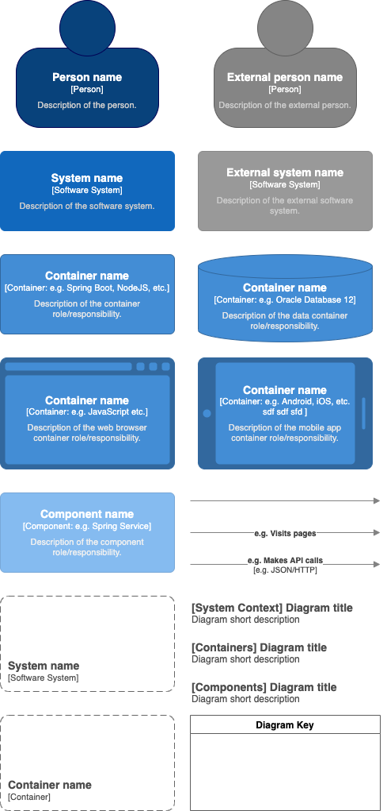
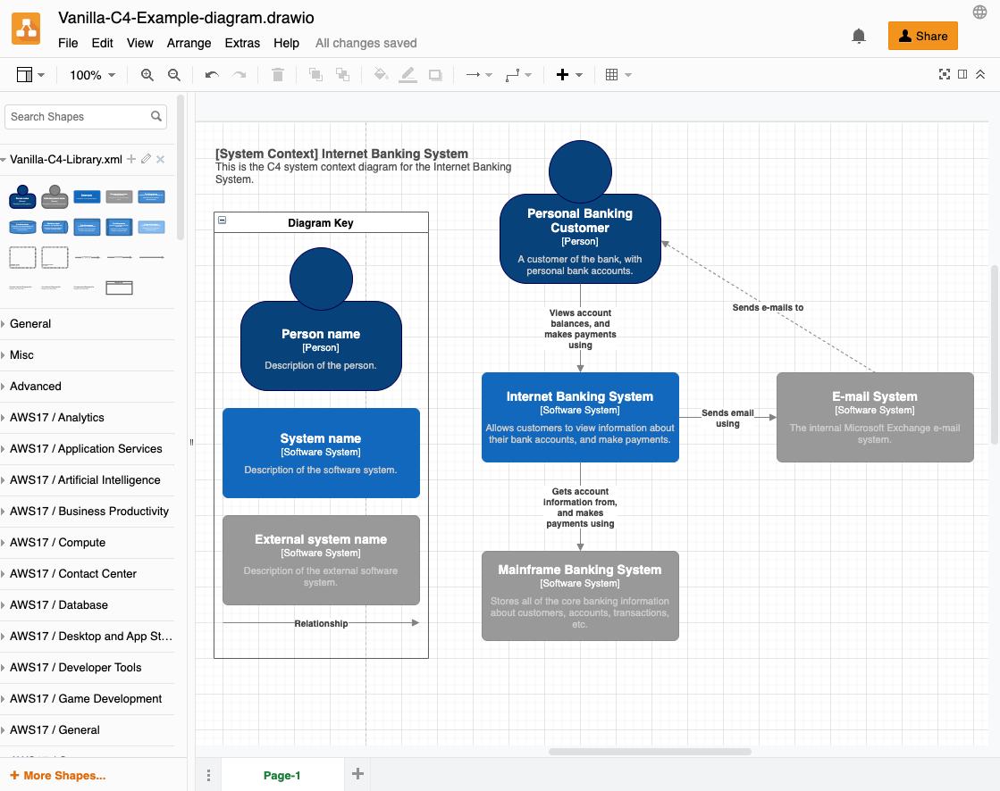

# Vanilla C4 for diagrams.net

<!-- START doctoc generated TOC please keep comment here to allow auto update -->
<!-- DON'T EDIT THIS SECTION, INSTEAD RE-RUN doctoc TO UPDATE -->
**Table of Contents**  *generated with [DocToc](https://github.com/thlorenz/doctoc)*

- [Vanilla C4 for diagrams.net](#vanilla-c4-for-diagramsnet)
- [Setup in diagrams.net / draw.io](#setup-in-diagramsnet--drawio)
    - [Public online version](#public-online-version)
    - [Self-hosted](#self-hosted)
    - [Atlassian Confluence Plugin](#atlassian-confluence-plugin)
    - [Desktop Application](#desktop-application)
- [Usage](#usage)
- [Credits](#credits)

<!-- END doctoc generated TOC please keep comment here to allow auto update -->

This is a fork of the original [**Hycom-C4**](https://github.com/hycomsa/hycom-c4) library tailored to be more in line with the examples and recommendations from [Simon Brows c4model.com](c4model.com). It allows you to visualise software architecture using the C4 model approach. The library lets you create C4 diagrams in an easy, quick and convenient way in the *diagrams.net* / *draw.io* application.

The **Vanilla C4** library contains the following easy to use elements:
- Person (internal and external)
- Software system (internal and external)
- Container (4 different types: generic, data, web browser and mobile app)
- Component
- Relationship (with description and technology, with generic description and plain)
- Scope boundary (software system and container)
- Diagram title (for system context, containers and components diagrams)
- Legend

# Setup in diagrams.net / draw.io
## Public online version
You can start really easy! Just click the following link and start using **Vanilla C4** library in *diagrams.net* online application: https://app.diagrams.net/?clibs=Uhttps://raw.githubusercontent.com/eatHikeCodeRepeat-Work/vanilla-c4/master/Vanilla-C4-Library.xml&splash=0

## Self-hosted
Simply append `?clibs=Uhttps://raw.githubusercontent.com/eatHikeCodeRepeat-Work/vanilla-c4/master/Vanilla-C4-Library.xml&splash=0` to the URL of you self-hosted diagrams.net / draw.io installation.

## Atlassian Confluence Plugin
For usage inside of the Confluence plugin, follow the steps described below:
1. Download [*Vanilla-C4-Library.xml*](./Vanilla-C4-Library.xml) file from the repository: https://github.com/eatHikeCodeRepeat-Work/vanilla-c4
2. Open the plugin / editor in Confluence.
3. click *File* > *Import...* and select the downloaded [`Vanilla-C4-Library.xml`](./Vanilla-C4-Library.xml)

After that, you should see the library on the left panel of the editor / plugin.

## Desktop Application
You can also use the **Vanilla C4** library in the *draw.io* / *diagrams.net* desktop application.

To do this follow the steps described below:
1. Download [*Vanilla-C4-Library.xml*](./Vanilla-C4-Library.xml) file from the repository: https://github.com/eatHikeCodeRepeat-Work/vanilla-c4
2. Start *draw.io* / *diagrams.net* desktop application.
3. Click *File* > *Open Library...* and then select the downloaded `Vanilla-C4-Library.xml` file.

After that, you should see the library on the left panel of the application.

# Usage
Simply use elements available in **Vanilla C4** library to create diagrams in very convenient way! Just drag elements from library and double-click on it to edit titles and descriptions. This is the most intuitive way to do it quick and easy with keeping aesthetic and readable form.

Below on the screen you can see **Vanilla C4** library on the left panel of *diagrams.net* application.

# Credits
- BIG thanks to [Maciek Śliwiński](https://github.com/maciek365) who created the original [hycom-c4](https://github.com/hycomsa/hycom-c4) plugin that this library is based on.
- [C4 Model by Simon Brown](https://c4model.com/) 
